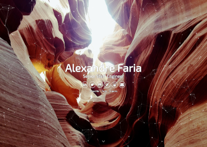

#Alexandre Faria's personal website : https://lusoalex.github.io

This is a simple and minimalist template for Jekyll designed for developers that want to show of their portfolio.

The Theme features:

- Gulp
- SASS
- Sweet Scroll
- Particle.js
- BrowserSync
- Font Awesome and Devicon icons
- Google Analytics
- Info Customization

## Basic Setup

1. [Install Jekyll](http://jekyllrb.com)
2. Fork the [Particle Theme](https://github.com/nrandecker/particle/fork)
3. Clone the repo you just forked.
4. Edit `_config.yml` to personalize your site.

## Install
1. `npm install`
2. `gulp`

## Run locally
1. For Mac OS install [RVM](https://usabilityetc.com/articles/ruby-on-mac-os-x-with-rvm/)
2. Follow these [instructions](https://help.github.com/en/articles/setting-up-your-github-pages-site-locally-with-jekyll)
3. Run `bundle exec jekyll serve`

## License

This project is free and open source software, distributed under the The MIT License. So feel free to use this Jekyll theme anyway you want.

## Credits

This theme was partially designed with the inspiration from these fine folks
- [Willian Justen](https://github.com/willianjusten/will-jekyll-template)
- [Vincent Garreau](https://github.com/VincentGarreau/particles.js/)
- [Nathan Randecker](https://github.com/nrandecker/particle)
- [Laurent Thiebault](https://github.com/lauthieb/lauthieb.github.io)
